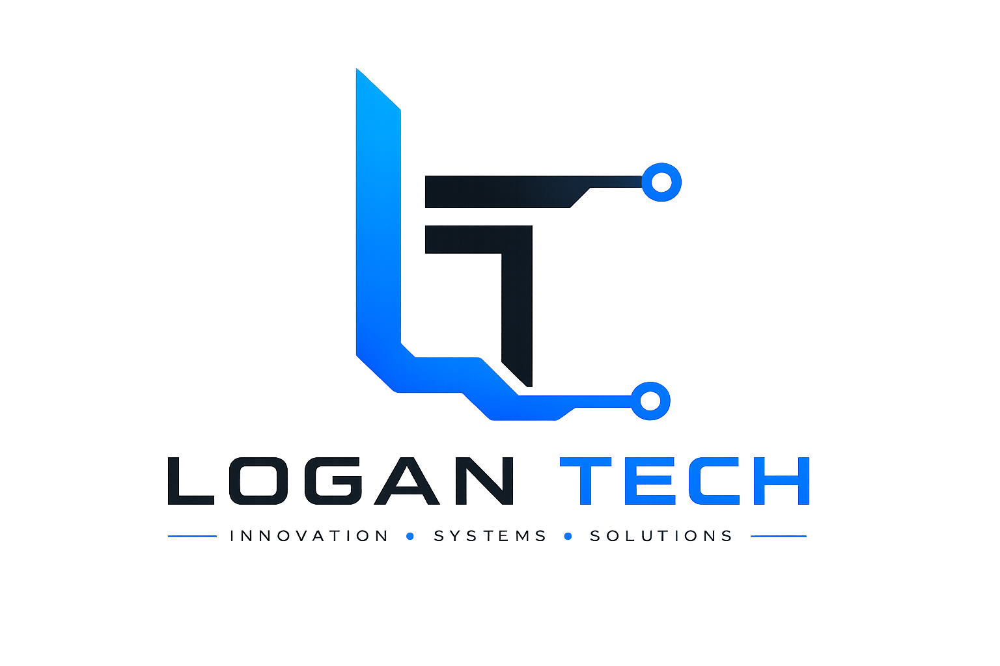

# Logan POS Product Documentation

Prepared for Logan Tech

## Muhtasari Kwa Kiswahili

**Logan POS** ni mfumo wa mauzo kwa maduka, wholesalers, pharmacies, hardware, mini supermarkets, na biashara zinazokua.

Mfumo unamsaidia mfanyabiashara kuuza, kufuatilia stock, kusimamia wateja wa credit, kurekodi running costs, na kuona profit halisi ya siku. Cashier anaweza kuendelea kuuza hata internet ikikatika, kisha mauzo husync pale connection ikirudi.

Ujumbe mkuu wa Logan POS ni huu: **biashara isiwe inategemea daftari pekee wakati mmiliki anahitaji kujua mauzo, stock, credit, na net profit kwa haraka.**

## 1. Product Summary

**Logan POS** is an offline-first point of sale system for shops, wholesalers, and growing retail businesses in East Africa.

It helps business owners manage sales, stock, customer credit, running costs, and profit from one dashboard. Cashiers can keep selling even when internet drops, then sync data when the connection returns.

## 2. Who It Is For

Logan POS is built for:

- Retail shops
- Mini supermarkets
- Wholesalers
- Pharmacies
- Cosmetics shops
- Electronics shops
- Hardware stores
- Multi-branch small businesses

The main users are:

- **Business owner:** checks sales, stock, profit, and credit balances.
- **Manager:** adds products, stock, prices, users, and reports.
- **Cashier:** sells products, prints or shares receipts, and handles payments.
- **Accountant:** reviews expenses, net profit, and credit records.

## 3. Core Value Proposition

**Run your shop with confidence, even when internet is unreliable.**

Logan POS gives owners a practical system for daily sales, stock control, customer credit, and net profit reporting.

## 4. Main Features

### Offline-First Cashier

- Sell products while offline.
- Search products from offline data.
- Save transactions locally.
- Sync pending transactions when internet returns.
- See sync status for pending or failed work.

### Product And Stock Management

- Add products with retail and wholesale prices.
- Add stock batches with buying cost.
- Track quantity available and quantity used.
- View low-stock products.
- Archive/delete products and stock batches safely.

### Credit Sales

- Sell to customers on credit.
- Require customer selection before credit sale.
- Show customer balance after credit sale.
- Track outstanding and overdue credit.

### Profit And Reports

- Daily report, 7-day report, 30-day report, and custom date range.
- Revenue, product cost, gross profit, running costs, and net profit.
- Product margin report.
- Top products by revenue.
- Payment method breakdown.

### Running Costs

- Record business expenses such as rent, transport, salary, electricity, internet, packaging, or other operating costs.
- Include running costs in net profit reports.

### Payments

- Cash
- Mobile money
- M-Pesa
- Azampay
- Card
- Bank transfer
- Cheque
- Credit

### Business Settings

- Business name
- Email
- Phone
- Business WhatsApp number
- Address
- Country
- Currency
- Payment integration settings

## 5. Why Logan POS Is Different

Most small shops do not only need a cash register. They need to know:

- What sold today?
- Which stock is almost finished?
- Which customer still owes money?
- Did the business make profit after expenses?
- What happens if internet fails?

Logan POS answers those questions in one place.

## 6. Basic Workflow

### Setup

1. Register business account.
2. Add business settings.
3. Add categories.
4. Add products and prices.
5. Add stock batches with buying cost.
6. Add users: admin, manager, cashier.

### Daily Sales

1. Cashier opens Point of Sale.
2. Searches product.
3. Adds product to cart.
4. Selects payment method.
5. Completes sale.
6. Shares or prints receipt.

### Credit Sale

1. Cashier selects customer.
2. Chooses credit as payment method.
3. Adds due date.
4. Completes sale.
5. Customer balance updates.

### Reporting

1. Owner opens Reports.
2. Selects daily, weekly, monthly, or custom period.
3. Reviews revenue, costs, gross profit, running costs, and net profit.
4. Checks low-stock and credit recommendations.

## 7. Sales Message

**Headline:** Logan POS helps you sell, track stock, and know your profit - even when internet is unstable.

**Short pitch:** Logan POS is made for East African shops that want clear sales, stock, credit, and profit reports without relying on paper books or spreadsheets.

**CTA:** Book a demo with Logan Tech.

## 8. Objection Handling

| Objection | Response |
|-----------|----------|
| Internet is not stable | Logan POS works offline and syncs later. |
| I already use a notebook | A notebook cannot instantly show stock, customer balance, and net profit. |
| My staff may not learn it | The cashier screen is built for simple daily selling. |
| I need to know profit | Reports show revenue, product cost, running costs, and net profit. |

## 9. Recommended Demo Script

1. Show dashboard.
2. Add a product.
3. Add stock with buying cost.
4. Make a cash sale.
5. Make a credit sale.
6. Show customer credit balance.
7. Show reports and net profit.
8. Turn off internet and show offline selling.
9. Reconnect and show sync status.

## 10. Launch Checklist

- Confirm company branding: Logan Tech.
- Confirm product name: Logan POS.
- Add logo to website and marketing assets.
- Prepare demo account.
- Prepare pricing packages.
- Prepare WhatsApp business number.
- Prepare onboarding process.
- Record a 2-minute demo video.
- Create social media launch posts.

## 11. Taglines

- Sell smarter. Manage better.
- Your shop, under control.
- Sales, stock, credit, and profit in one POS.
- Built for shops that cannot stop selling.
- Offline-ready POS for growing businesses.
